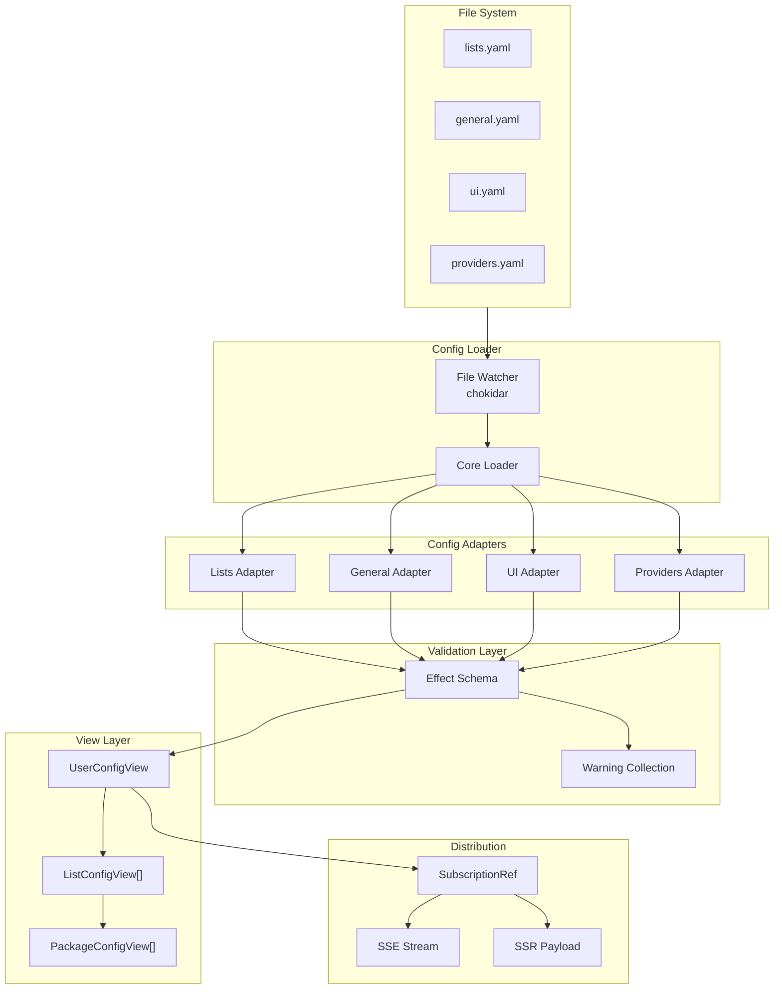

The config system is one of the most sophisticated parts of Shipped. It provides a reactive, type-safe, and resilient configuration mechanism that never crashes the app due to user error.

## Design Goals

1. **Reactive E2E** - File changes propagate to UI without restart
2. **Graceful Degradation** - Invalid config items are removed, not crashed
3. **Type Safety** - Runtime validation at every step
4. **SSR Compatible** - Config available during server-side rendering
5. **Automatic Recovery** - File watcher never gives up

## Architecture Overview



## The "Never Fail" Philosophy

The config system operates on a simple principle: **user errors should never crash the app**. This is implemented at multiple levels:

### Level 1: Initial Load

The app handles missing or invalid config files gracefully by using defaults:

- **Missing files** - Default config files are created automatically
- **Unparsable files** - Defaults are used, error is logged
- **Bug in loading code** - App fails to start (this is a bug, not user error)

### Level 2: File Watching

Once the app is running, the file watcher takes over. If a reload fails:

- The error is logged
- The **previous config is kept**
- The app continues running

**Implementation in `server/services/config/index.ts:25`:**

```typescript
const reloadConfigView = Effect.gen(function* () {
  const raw = yield* config.get;
  const newView = UserConfigView.make(raw);
  yield* SubscriptionRef.set(configView, newView);
  yield* Effect.logInfo("Config view updated");
}).pipe(
  Effect.tapError((error) => 
    Effect.logError("Failed to update config view, keeping previous", error)
  ),
  Effect.catchAll(() => Effect.void), // Swallow error, keep old config
);
```

### Level 3: Adapter Validation

Each config adapter validates its own section independently. If one package is invalid, only that package is removed:

**From `server/services/config/loader/adapters/lists.ts:98`:**

```typescript
const validLists: ListConfig[] = [];
const warnings: ConfigWarning[] = [];

// Each package validated individually
for (const pkg of list.packages) {
  const validated = packageDecoder(pkg);
  if (validated._tag === "Left") {
    // Add warning, skip this package
    warnings.push({
      message: `Invalid package: ${validated.left.message}`,
      severity: "warning",
    });
    continue;
  }
  validatedPackages.push(validated.right);
}
```

## Config Adapters

Adapters are the heart of the config system. Each adapter handles one config file type and can:

- Parse YAML
- Validate with Effect Schema
- Merge with defaults
- Collect warnings for invalid items
- Transform into view-ready format

### Lists Adapter

The most complex adapter. It validates package lists and groups.

**Location:** `server/services/config/loader/adapters/lists.ts`

**Default Configuration:**

```typescript
const DEFAULT_CONTENT = [
  ListConfig.make({
    name: "Tech stack",
    description: "App tech stack. Edit lists.yaml to customize.",
    groups: [
      {
        name: "shipped",
        showName: false,
        packages: [
          {
            name: "nipakke/shipped",
            provider: "github",
          },
        ],
      },
      // ... more groups
    ],
  }),
];
```

### General Adapter

Simple adapter with defaults for application-wide settings.

**Location:** `server/services/config/loader/adapters/general.ts`

### UI Adapter

Handles UI-specific settings like display preferences.

**Location:** `server/services/config/loader/adapters/ui.ts`

### Providers Adapter

Manages provider-specific settings and merges extras.

**Location:** `server/services/config/loader/adapters/providers.ts`

## Effect Schema Server Validation

All server-side configuration data is modeled and validated using Effect Schema:

```typescript
import { Schema } from "effect";

const PackageConfig = Schema.Struct({
  name: Schema.String,
  provider: Schema.String,
  extra: Schema.optionalWith(
    Schema.Record({ key: Schema.String, value: Schema.Unknown }),
    { default: () => ({}) }
  ),
});

// Runtime validation during file parsing
const result = Schema.decodeUnknownSync(PackageConfig)(rawData);
```

**Benefits for Server Configurations:**

- **Compile-time types** from schema
- **Runtime validation** of all configuration YAML/JSON data
- **Automatic decoding** from unknown/JSON into Effect structures
- **Composable** - schemas build on each other perfectly in an Effect TS environment

<Note>
While Effect Schema manages server-side validation and logic, client-side boundaries and RPC contracts typically use Zod v4.
</Note>

## View Classes

View classes transform raw config into structured objects with computed properties.

### PackageConfigView

**Location:** `libs/config/views/package.ts:7`

```typescript
export class PackageConfigView extends Data.Class<
  PackageConfig & {
    providerConfig?: ProviderConfig;
  }
> {
  providerExtra = this.providerConfig?.extra;

  // Computed hash for this package
  packageId = PackageConfigView.hash(this);

  get spec(): PackageSpec {
    return {
      name: this.name,
      provider: this.provider,
      extra: this.extra,
    };
  }

  static hash(config: PackageConfigView): string {
    // Human-readable in dev mode
    if (import.meta.dev) {
      return `${config.spec.name}:${config.spec.provider}:${hash(config.spec.extra)}:${JSON.stringify(config.providerExtra)}`;
    }
    // Hashed in production
    return hash({
      spec: config.spec,
      extra: config.providerExtra,
    });
  }
}
```

### UserConfigView

The main aggregation point that provides fast package lookup:

```typescript
class UserConfigView extends Data.Class<{
  readonly general: GeneralConfigView;
  readonly ui: UIConfigView;
  readonly lists: readonly ListConfigView[];
  readonly providers: ProvidersConfigView;
  readonly warnings: readonly ConfigWarning[];
}> {
  // Fast O(1) lookup by package hash
  get packageMap(): ReadonlyMap<string, PackageConfigView> {
    const map = new Map<string, PackageConfigView>();
    for (const list of this.lists) {
      for (const pkg of list.packages) {
        map.set(pkg.id, pkg);
      }
    }
    return map;
  }

  // Get package by hash
  getPackageById(id: string): Option<PackageConfigView> {
    return Option.fromNullable(this.packageMap.get(id));
  }
}
```

## File Watching with Chokidar

Shipped uses chokidar for efficient file watching with Effect TS integration.

**Implementation in `server/libs/chokidar/index.ts:12`:**

```typescript
export const watch = (paths: string | string[], opts?: WatchOptions) =>
  Effect.gen(function* () {
    const filesPubSub = yield* PubSub.bounded<{ event: Events; path: string }>(128);
    yield* Effect.addFinalizer(() => filesPubSub.shutdown);

    const stream = Stream.asyncScoped<{ event: Events; path: string }, unknown>(
      (emit) =>
        Effect.acquireRelease(
          Effect.sync(() => {
            const watcher = chokidar.watch(paths, opts);
            watcher.on("all", (event, path) => {
              emit(Effect.succeed(Chunk.make({ event, path })));
            });
            return watcher;
          }),
          (watcher) =>
            Effect.promise(async () => {
              watcher.removeAllListeners();
              await watcher.close();
            })
        )
    );

    return { stream, pubsub: filesPubSub };
  });
```

The `Effect.acquireRelease` pattern ensures:
- File watcher is properly initialized
- Cleanup happens automatically when the effect completes
- No resource leaks

## Config Distribution

### SubscriptionRef Pattern

The server uses Effect's `SubscriptionRef` for reactive state:

```typescript
const configRef = SubscriptionRef.make(initialConfig);

// Any update broadcasts to subscribers
yield * configRef.set(newConfig);

// Subscribers receive updates
yield * configRef.changes.pipe(
  Stream.runForEach((config) => {
    // Broadcast to all connected clients
  })
);
```

### SSR Injection

During SSR, the server injects raw config into Nuxt's payload state:

```typescript
// layers/01-base/app/plugins/02-config.ts (server side)
if (import.meta.server) {
  const rpc = useRPC();
  const userConfig = await rpc.config.get.call();

  // Inject into Nuxt's payload state for hydration
  if (userConfig && nuxtApp?.payload.state) {
    injectUserConfig(nuxtApp.payload.state, userConfig);
  }
}

const key = "#USER_CONFIG";

export function injectUserConfig(obj: unknown, data: UserConfig) {
  if (obj && typeof obj === "object") {
    Object.assign(obj, {
      [key]: Schema.encodeSync(UserConfig)(data),
    });
  }
}
```

### Client Hydration

The client extracts config from Nuxt's payload state and reconstructs the view:

```typescript
// layers/01-base/app/plugins/02-config.ts (client side)
if (import.meta.client) {
  const nuxtApp = tryUseNuxtApp();
  const initialData = extractUserConfig(nuxtApp?.payload.state);
  applyConfig(initialData);
}

export function extractUserConfig(obj: unknown): UserConfig | undefined {
  if (obj && typeof obj === "object" && key in obj) {
    try {
      return Schema.decodeUnknownSync(UserConfig)(obj[key]);
    } catch (error) {
      console.warn("Failed to decode config from payload:", error);
    }
  }
}

function applyConfig(userConfig?: UserConfig | null) {
  const decoded = Schema.decodeUnknownOption(UserConfig)(userConfig);
  if (Option.isSome(decoded)) {
    data.value = UserConfigView.make(decoded.value);
  } else {
    error.value = "Failed to apply config";
  }
}
```

### SSE Streaming via ORPC

When `streamConfigChanges` is enabled (default), clients receive real-time updates using ORPC's streaming:

```typescript
// Client side
import { consumeEventIterator } from "@orpc/client";

async function start() {
  if (!isStreamingEnabled.value) return;

  unsubscribeStream = consumeEventIterator(
    useRPC().config.getStream.call(undefined),
    {
      onEvent(val) {
        isConnected.value = true;
        streamError.value = undefined;
        applyConfig(val);
      },
      onError: (error) => {
        console.error("Failed to create stream for config:", error);
        streamError.value = error.message;
        isConnected.value = false;
        // Auto-retry
        setTimeout(start, 2000);
      },
    }
  );
}
```

## Error Boundaries

The config system has clear error boundaries:

| Level        | Error Type    | Behavior                   |
| ------------ | ------------- | -------------------------- |
| Initial Load | Missing files | Create defaults            |
| Initial Load | Parse errors  | Use defaults, log error    |
| Initial Load | Bug in code   | App fails to start         |
| File Watch   | Bug in reload | Keep old config, log error |
| Adapter      | Invalid items | Remove item, add warning   |
| Schema       | Type mismatch | Use default, log warning   |
| View         | Logic error   | Fallback to defaults       |

## Making Changes

### Adding a New Config Field

1. Update the schema in `libs/config/schemas/`:

```typescript
const GeneralConfig = Schema.Struct({
  existingField: Schema.String,
  newField: Schema.Boolean.pipe(
    Schema.optionalWith({ default: () => false })
  ),
});
```

2. Access in view class if needed

3. Document in configuration reference

### Adding a New Config File

1. Create adapter in `server/services/config/loader/adapters/`:

```typescript
export const myAdapter: ConfigAdapter<MyConfig> = {
  fileName: "myconfig.yaml",
  parse: (content) =>
    Effect.gen(function* () {
      // Parse and validate
    }),
};
```

2. Add to loader

3. Add to UserConfig schema and view

## Debugging

### Viewing Current Config

Access the reactive config in Vue DevTools:

- Look for `useUserConfig()` composable
- Inspect `data.value` for current UserConfigView

### Checking Warnings

Warnings are available via the config data:

```typescript
const { data } = useUserConfig();
const warnings = computed(() => data.value?.warnings ?? []);
```

### File Watcher Status

To check if the file watcher is working:

1. Edit a config file in the `config/` directory
2. Save the file
3. Check browser console for SSE connection status
4. Verify UI updates with new config

You can also check the streaming status:

```typescript
const { isConnected, streamError } = useUserConfig();
// isConnected.value - true if actively streaming
// streamError.value - any connection errors
```

## Summary

The config system provides:

- **File-based configuration** with hot reloading
- **Type-safe validation** at every boundary
- **Graceful degradation** for invalid items
- **Reactive distribution** via SSE
- **SSR compatibility** with payload injection

This architecture enables users to iterate on configuration quickly while maintaining system stability.
