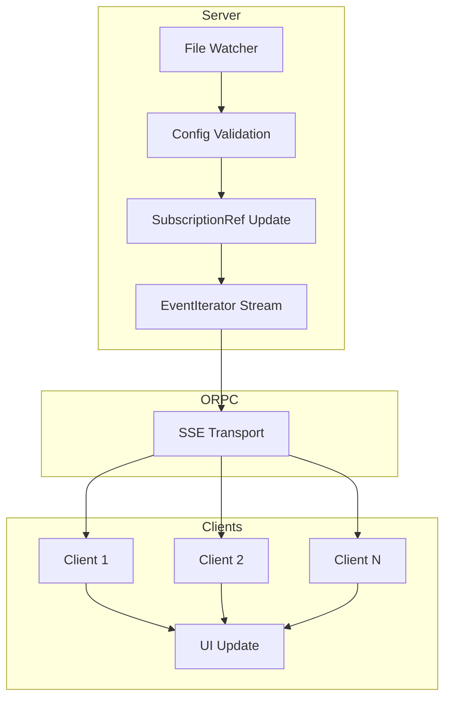

The `general.yaml` file controls general application settings and behaviors. These settings affect how Shipped operates and how configuration changes are distributed to clients.

## File Location

Place `general.yaml` in your config directory:
- **Docker**: `/data/config/general.yaml` (default)
- **Custom**: Set via `SERVER_CONFIG_DIR` environment variable

## Configuration Options

### streamConfigChanges

Controls whether configuration changes are streamed to connected clients in real-time via Server-Sent Events (SSE).

<ParamField path="streamConfigChanges" type="boolean" default={true}>
  Enable real-time streaming of configuration changes to connected clients. When enabled:
  
  - File changes are detected by the watcher
  - Configuration is validated and updated
  - Changes are broadcast to all connected clients via SSE
  - UI updates automatically without page refresh
  
  When disabled:
  
  - Configuration still hot-reloads on the server
  - Clients must manually refresh to see changes
  - Reduces server-side event streaming overhead
  
  Default: `true`
</ParamField>

## Schema

The general configuration uses a simple schema:

```typescript
const GeneralConfig = Schema.Struct({
  streamConfigChanges: Schema.Boolean.pipe(Schema.optional),
});
```

## Example Configuration

```yaml general.yaml
# Enable real-time config updates (default)
streamConfigChanges: true
```

<CodeGroup>
```yaml Enable Streaming (Default)
streamConfigChanges: true
```

```yaml Disable Streaming
streamConfigChanges: false
```
</CodeGroup>

## Default Values

If `general.yaml` is missing or empty, these defaults are used:

```yaml Default general.yaml
streamConfigChanges: true
```

## Streaming Architecture

When `streamConfigChanges` is enabled, configuration updates flow from server to clients via ORPC's streaming capabilities:



### How It Works

<Steps>
  <Step title="File Change Detection">
    Chokidar detects a change in any config file (lists.yaml, providers.yaml, etc.)
  </Step>
  
  <Step title="Validation and Update">
    Config is parsed, validated with Effect Schema, and the SubscriptionRef is updated
  </Step>
  
  <Step title="Stream Broadcast">
    The SubscriptionRef change triggers an event in the EventIterator stream
  </Step>
  
  <Step title="SSE Transport">
    ORPC transports the event to all connected clients via Server-Sent Events
  </Step>
  
  <Step title="Client Update">
    Clients receive the event, decode the config, and update their reactive state
  </Step>
  
  <Step title="UI Refresh">
    Vue's reactivity system automatically updates the UI with new config data
  </Step>
</Steps>

## Client-Side Behavior

The client-side handles streaming automatically via the `useUserConfig()` composable:

```typescript
// Client-side plugin (layers/01-base/app/plugins/02-config.ts)
import { consumeEventIterator } from '@orpc/client';

if (isStreamingEnabled.value) {
  unsubscribeStream = consumeEventIterator(
    useRPC().config.getStream.call(undefined),
    {
      onEvent(val) {
        // New config received - update reactive state
        isConnected.value = true;
        applyConfig(val);
      },
      onError(error) {
        // Stream error - will auto-retry
        console.error('Failed to create stream for config:', error);
        isConnected.value = false;
        setTimeout(start, 2000); // Retry after 2 seconds
      },
    }
  );
}
```

### Stream Status

You can monitor the stream status in your application:

```typescript
const { isConnected, streamError } = useUserConfig();

// isConnected.value - true if actively streaming
// streamError.value - any connection errors
```

## Performance Considerations

<Accordion title="When to Enable Streaming">
  **Enable** when:
  - You frequently update configuration
  - Multiple users need to see changes immediately
  - Your deployment supports SSE connections
  - You want the best user experience
  
  **Benefits**:
  - Instant UI updates without refresh
  - No polling overhead
  - Efficient server-to-client communication
</Accordion>

<Accordion title="When to Disable Streaming">
  **Disable** when:
  - Configuration rarely changes
  - SSE connections are problematic (some proxies/load balancers)
  - You want to reduce server-side event streaming overhead
  - Manual refresh is acceptable
  
  **Benefits**:
  - Slightly reduced server overhead
  - No long-lived SSE connections
  - Simpler debugging
</Accordion>

## Validation and Error Handling

<Accordion title="Validation Rules">
  1. **streamConfigChanges** must be a boolean
  2. Invalid values fall back to the default (`true`)
</Accordion>

### Invalid Configuration Handling

When general configuration is invalid:

1. Invalid fields are **ignored**
2. **Default values** are used
3. A **warning is logged** with validation details
4. The **application continues** running normally

## IDE Autocompletion

Enable IDE autocompletion by adding the schema reference:

```yaml general.yaml
# yaml-language-server: $schema: https://raw.githubusercontent.com/nipakke/shipped/main/docs/config-files/general.json

streamConfigChanges: true
```

## Hot Reloading

Changes to `general.yaml` are automatically detected and applied:

1. **Edit** `general.yaml` in your config directory
2. **Save** the file
3. **Shipped automatically** reloads the configuration
4. **Streaming behavior** updates based on new setting

<Note>
  Changing `streamConfigChanges` from `true` to `false` will disconnect active SSE streams. Clients will need to manually refresh to see further config updates.
  
  Changing from `false` to `true` requires clients to refresh to establish the SSE connection.
</Note>

## Usage Examples

<AccordionGroup>
  <Accordion title="Enable real-time updates (recommended)">
    Default configuration with optimal user experience:
    
    ```yaml general.yaml
    streamConfigChanges: true
    ```
  </Accordion>
  
  <Accordion title="Disable streaming for static deployments">
    When configuration rarely changes:
    
    ```yaml general.yaml
    streamConfigChanges: false
    ```
  </Accordion>
</AccordionGroup>

## SSE Connection Details

When streaming is enabled:

- **Protocol**: Server-Sent Events (SSE) over HTTP
- **Transport**: ORPC event iterator
- **Reconnection**: Automatic with 2-second retry delay
- **Heartbeat**: Managed by ORPC
- **Compression**: Depends on server/proxy configuration

### Proxy Considerations

<Warning>
  Some reverse proxies or load balancers may not handle SSE connections well. If you experience streaming issues:
  
  1. Check proxy/load balancer SSE support
  2. Verify timeout settings (SSE requires long-lived connections)
  3. Consider disabling streaming if issues persist
  4. Use manual refresh as a fallback
</Warning>

## Manual Refresh

Even with streaming enabled, you can manually refresh configuration:

```typescript
const { refresh } = useUserConfig();

// Force a config refresh
await refresh();
```

This performs a one-time HTTP request to fetch the latest configuration.

## Server-Side Implementation

The server exposes two RPC endpoints for configuration:

```typescript
// One-time fetch
config.get.call(): Promise<UserConfig>

// Streaming (if enabled)
config.getStream.call(): EventIterator<UserConfig>
```

The streaming endpoint returns an Effect `Stream` that's converted to an EventIterator for ORPC transport.

## Complete Example

Here's a complete `general.yaml` with all available options:

```yaml general.yaml
# yaml-language-server: $schema: https://raw.githubusercontent.com/nipakke/shipped/main/docs/config-files/general.json

# Enable real-time streaming of configuration changes
streamConfigChanges: true
```

## Troubleshooting

<AccordionGroup>
  <Accordion title="Streaming not working">
    1. Verify `streamConfigChanges: true` in `general.yaml`
    2. Check browser console for connection errors
    3. Verify SSE endpoint is accessible (check network tab)
    4. Check for proxy/load balancer issues
    5. Try disabling browser extensions that might block SSE
  </Accordion>
  
  <Accordion title="Frequent disconnections">
    1. Check proxy timeout settings (need to allow long-lived connections)
    2. Verify network stability
    3. Look for error messages in browser console
    4. Check server logs for connection issues
  </Accordion>
  
  <Accordion title="Config changes not appearing">
    1. Verify file is saved in the correct location
    2. Check YAML syntax is valid
    3. Look for validation errors in application logs
    4. Try manually refreshing the page
    5. Verify `streamConfigChanges` is enabled
  </Accordion>
</AccordionGroup>

## Environment Variables

General configuration works alongside environment variables:

| Variable | Type | Default | Description |
|----------|------|---------|-------------|
| `SERVER_CONFIG_DIR` | string | `config` | Config files directory |
| `SERVER_CONFIG_WATCH_POLLING` | boolean | `false` | Use polling for file watching |

These are **static** settings that require a container restart to change, unlike `general.yaml` which supports hot reloading.

## Next Steps

<CardGroup cols={2}>
  <Card title="UI Customization" icon="palette" href="/configuration/ui-customization">
    Customize the user interface
  </Card>
  <Card title="Configuration Overview" icon="settings" href="/configuration/overview">
    Learn about the config system
  </Card>
</CardGroup>