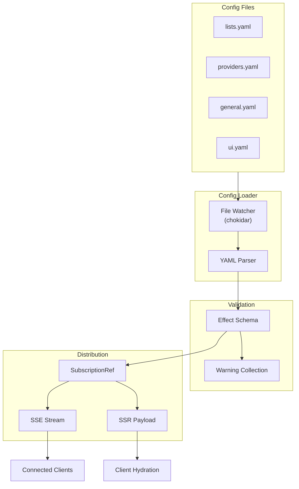

Shipped uses a flexible, file-based configuration system that supports hot-reloading and graceful degradation. Configuration is split into two types: dynamic YAML files and static environment variables.

## Configuration Types

<CardGroup cols={2}>
  <Card title="Dynamic Configuration" icon="file-code" href="#dynamic-configuration">
    YAML files that update without restart
  </Card>
  <Card title="Static Configuration" icon="server" href="#static-configuration">
    Environment variables requiring restart
  </Card>
</CardGroup>

## Dynamic Configuration

Dynamic configuration uses YAML files in your config directory (default: `/data/config` in Docker). Changes to these files are automatically detected and applied without restarting the container.

| File | Purpose | Reference |
|------|---------|----------|
| `lists.yaml` | Define which packages to track | [Lists Guide](/configuration/lists) |
| `providers.yaml` | Configure provider defaults and options | [Providers Guide](/configuration/providers) |
| `general.yaml` | General application settings | [General Settings](/configuration/general-settings) |
| `ui.yaml` | UI customization options | [UI Customization](/configuration/ui-customization) |

### File Watching

The config system uses [chokidar](https://github.com/paulmillr/chokidar) to monitor file changes:

- **Automatic reload** - Changes detected and applied in real-time
- **Debounced processing** - Multiple rapid changes are batched
- **Stream-based updates** - Connected clients receive updates via SSE
- **Polling mode** - Available for Docker/network filesystems

<Note>
  If file watching doesn't work in your environment (common in Docker on macOS or network filesystems), enable polling mode:
  
  ```bash
  SERVER_CONFIG_WATCH_POLLING=true
  ```
</Note>

## Static Configuration

Static configuration uses environment variables and requires a container restart to change. These control server behavior, caching, and system-level settings.

<Accordion title="Common Environment Variables">
  | Variable | Type | Default | Description |
  |----------|------|---------|-------------|
  | `SERVER_CONFIG_DIR` | string | `config` | Config files directory (relative or absolute) |
  | `SERVER_CONFIG_WATCH_POLLING` | boolean | `false` | Use polling for file watching |
  | `SERVER_PACKAGES_FETCH_CONCURRENCY` | integer | `10` | Max parallel package fetches |
  | `SERVER_PACKAGES_CACHE_TTL` | integer | `10800` | Cache TTL in seconds (3 hours) |
  | `SERVER_PACKAGES_CACHE_DISABLED` | boolean | `false` | Disable package caching |
  
  See the [Environment Variables reference](https://github.com/nipakke/shipped/blob/main/docs/env.md) for the complete list.
</Accordion>

## Graceful Degradation

Shipped's config system is designed to **never crash the app** due to user configuration errors:

<Steps>
  <Step title="Missing Files">
    Default config files are created automatically if missing.
  </Step>
  <Step title="Parse Errors">
    Defaults are used and errors are logged. Previous config is retained on reload failures.
  </Step>
  <Step title="Invalid Items">
    Invalid packages or settings are skipped with warnings. The rest of the config remains functional.
  </Step>
  <Step title="Schema Validation">
    Type mismatches use defaults and log warnings without crashing.
  </Step>
</Steps>

### Validation and Warnings

Configuration is validated at multiple levels:

1. **YAML parsing** - Syntax errors are caught and logged
2. **Effect Schema validation** - Runtime type checking with detailed errors
3. **Provider validation** - Package-specific validation against provider schemas
4. **View construction** - Final validation before use in the application

Warnings are collected during validation and displayed in the UI, helping you identify and fix configuration issues without breaking the application.

## IDE Support

Shipped generates JSON schemas for all config files to provide IDE autocompletion and validation.

<Tabs>
  <Tab title="VSCode">
    Add the schema reference to the top of your YAML files:
    
    ```yaml lists.yaml
    # yaml-language-server: $schema: https://raw.githubusercontent.com/nipakke/shipped/main/docs/config-files/lists.json
    
    - name: My Packages
      groups:
        - name: frameworks
          packages:
            - provider: npm
              name: react
    ```
  </Tab>
  <Tab title="Available Schemas">
    - [lists.json](https://raw.githubusercontent.com/nipakke/shipped/main/docs/config-files/lists.json) - Package lists
    - [providers.json](https://raw.githubusercontent.com/nipakke/shipped/main/docs/config-files/providers.json) - Provider defaults
    - [general.json](https://raw.githubusercontent.com/nipakke/shipped/main/docs/config-files/general.json) - General settings
    - [ui.json](https://raw.githubusercontent.com/nipakke/shipped/main/docs/config-files/ui.json) - UI customization
  </Tab>
</Tabs>

## Real-Time Updates

By default, Shipped streams configuration changes to all connected clients using Server-Sent Events (SSE) via ORPC.

<CodeGroup>
```yaml general.yaml
# Enable/disable real-time config streaming (default: true)
streamConfigChanges: true
```

```typescript Client-side streaming
// Automatically handled by useUserConfig() composable
const { data, isConnected, streamError } = useUserConfig();

// isConnected.value - true if actively streaming
// streamError.value - any connection errors
// data.value - current configuration view
```
</CodeGroup>

### How It Works

1. **File Change** - chokidar detects a change in a config file
2. **Validation** - Config is parsed and validated with Effect Schema
3. **SubscriptionRef Update** - Server updates its reactive configuration reference
4. **SSE Broadcast** - Change is streamed to all connected clients
5. **Client Update** - Clients receive and apply the new configuration
6. **UI Refresh** - UI updates automatically without page reload

<Tip>
  If streaming is disabled or fails, you can manually refresh configuration:
  
  ```typescript
  const { refresh } = useUserConfig();
  await refresh();
  ```
</Tip>

## Configuration Flow



## Next Steps

<CardGroup cols={2}>
  <Card title="Lists Configuration" icon="list" href="/configuration/lists">
    Define which packages to track
  </Card>
  <Card title="Providers Configuration" icon="plug" href="/configuration/providers">
    Configure provider-specific options
  </Card>
  <Card title="General Settings" icon="sliders" href="/configuration/general-settings">
    Application-wide settings
  </Card>
  <Card title="UI Customization" icon="palette" href="/configuration/ui-customization">
    Customize the user interface
  </Card>
</CardGroup>