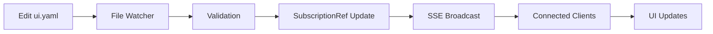

The `ui.yaml` file controls UI-specific customization options. Currently, it provides basic layout controls with plans for more customization options in the future.

## File Location

Place `ui.yaml` in your config directory:
- **Docker**: `/data/config/ui.yaml` (default)
- **Custom**: Set via `SERVER_CONFIG_DIR` environment variable

## Configuration Options

### maxListsInHeader

Controls the maximum number of lists displayed in the header navigation before overflow.

<ParamField path="maxListsInHeader" type="number" default={3}>
  Maximum number of lists to show in the header navigation. When you have more lists than this value, additional lists are accessible via a dropdown or secondary navigation.
  
  Default: `3`
</ParamField>

## Schema

The UI configuration uses a simple schema:

```typescript
const UIConfig = Schema.Struct({
  maxListsInHeader: Schema.Number.pipe(Schema.optional),
});
```

## Example Configuration

```yaml ui.yaml
# Show up to 5 lists in the header navigation
maxListsInHeader: 5
```

<CodeGroup>
```yaml Default (3 lists)
maxListsInHeader: 3
```

```yaml More lists (5 lists)
maxListsInHeader: 5
```

```yaml Minimal (1 list)
maxListsInHeader: 1
```
</CodeGroup>

## Default Values

If `ui.yaml` is missing or empty, these defaults are used:

```yaml Default ui.yaml
maxListsInHeader: 3
```

## Validation and Error Handling

<Accordion title="Validation Rules">
  1. **maxListsInHeader** must be a number
  2. Values should be positive integers (1 or greater)
  3. Invalid values fall back to the default (3)
</Accordion>

### Invalid Configuration Handling

When UI configuration is invalid:

1. Invalid fields are **ignored**
2. **Default values** are used
3. A **warning is logged** with validation details
4. The **application continues** running normally

## IDE Autocompletion

Enable IDE autocompletion by adding the schema reference:

```yaml ui.yaml
# yaml-language-server: $schema: https://raw.githubusercontent.com/nipakke/shipped/main/docs/config-files/ui.json

maxListsInHeader: 5
```

## Hot Reloading

Changes to `ui.yaml` are automatically detected and applied:

1. **Edit** `ui.yaml` in your config directory
2. **Save** the file
3. **Shipped automatically** reloads the configuration
4. **UI updates** reflect changes immediately (if streaming is enabled)

<Tip>
  No restart required! UI changes are picked up by the file watcher and streamed to connected clients.
</Tip>

## Usage Examples

<AccordionGroup>
  <Accordion title="Many lists (show more in header)">
    If you have many lists and want more visible in the header:
    
    ```yaml ui.yaml
    maxListsInHeader: 8
    ```
  </Accordion>
  
  <Accordion title="Minimal header (single list)">
    For a cleaner header with minimal navigation:
    
    ```yaml ui.yaml
    maxListsInHeader: 1
    ```
  </Accordion>
  
  <Accordion title="Default (3 lists)">
    Balanced header navigation:
    
    ```yaml ui.yaml
    maxListsInHeader: 3
    ```
  </Accordion>
</AccordionGroup>

## Real-Time Updates

UI configuration changes are streamed to clients in real-time via SSE (Server-Sent Events):



<Note>
  If `streamConfigChanges` is disabled in `general.yaml`, you'll need to manually refresh the page to see UI configuration changes.
</Note>

## Future Customization Options

While currently limited to header navigation control, future versions of Shipped may include additional UI customization options such as:

- Theme customization (colors, fonts)
- Layout options (grid vs. list views)
- Display density settings
- Custom branding elements

<Info>
  The UI configuration system is designed for easy expansion. Check the [GitHub repository](https://github.com/nipakke/shipped) for updates and feature requests.
</Info>

## Client-Side Access

The UI configuration is available client-side via the `useUserConfig()` composable:

```typescript
import { useUserConfig } from '#imports';

const { data } = useUserConfig();

// Access UI config
const maxListsInHeader = computed(() => {
  return data.value?.ui.maxListsInHeader ?? 3;
});
```

The configuration is:
- **Type-safe** with TypeScript
- **Reactive** with Vue 3's reactivity system
- **Validated** with Effect Schema
- **Automatically updated** when config files change

## Complete Example

Here's a complete `ui.yaml` with all available options:

```yaml ui.yaml
# yaml-language-server: $schema: https://raw.githubusercontent.com/nipakke/shipped/main/docs/config-files/ui.json

# Maximum number of lists in header navigation
maxListsInHeader: 5
```

## Troubleshooting

<AccordionGroup>
  <Accordion title="Changes not appearing">
    1. Verify the file is saved in the correct location
    2. Check that `streamConfigChanges` is enabled in `general.yaml`
    3. Look for validation errors in the application logs
    4. Try manually refreshing the page
  </Accordion>
  
  <Accordion title="Configuration not loading">
    1. Verify YAML syntax is correct
    2. Check file permissions (must be readable by the container)
    3. Look for error messages in container logs
    4. Try removing the file to trigger default config creation
  </Accordion>
  
  <Accordion title="Want more customization options">
    UI customization options are intentionally limited in the current version. To request new features:
    
    1. Check existing issues on [GitHub](https://github.com/nipakke/shipped/issues)
    2. Create a feature request with your use case
    3. Consider contributing to the project
  </Accordion>
</AccordionGroup>

## Next Steps

<CardGroup cols={2}>
  <Card title="General Settings" icon="sliders" href="/configuration/general-settings">
    Configure application behavior
  </Card>
  <Card title="Configuration Overview" icon="settings" href="/configuration/overview">
    Learn about the config system
  </Card>
</CardGroup>