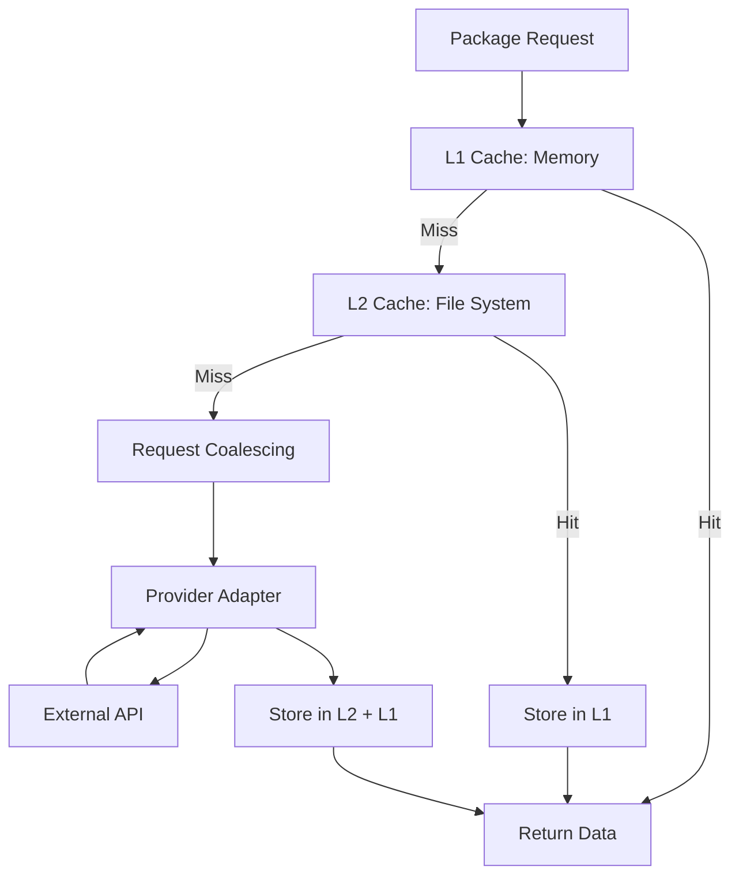

## Overview

Shipped implements a sophisticated multi-layer caching system to minimize expensive external API calls to package registries. The cache architecture combines in-memory (L1) and persistent file-based (L2) storage with request coalescing to prevent duplicate concurrent requests.

## Architecture

### Two-Layer Design



### Cache Layers

| Layer | Backend | Speed | Persistence | Max Size | Eviction |
|-------|---------|-------|-------------|----------|----------|
| **L1** | Memory (Map) | ~0.1ms | No (lost on restart) | Configurable (default: 50MB / 2000 items) | LRU |
| **L2** | File System | ~5-10ms | Yes (survives restart) | Unlimited | TTL-based pruning |

**Reference**: `server/services/package/cache.ts:23-44`

## Implementation Details

### BentoCache Backend

Shipped uses [BentoCache](https://bentocache.dev/) for the underlying cache implementation:

```typescript
// server/services/package/cache.ts:23
const bento = new BentoCache({
  default: "default",
  stores: {
    default: bentostore()
      .useL1Layer(
        memoryDriver({
          maxSize: config.packages.cache.maxSize,      // default: "50mb"
          maxItems: config.packages.cache.maxItems,    // default: 2000
        }),
      )
      .useL2Layer(
        fileDriver({
          directory: path.relative(process.cwd(), cacheDir),
          pruneInterval: Duration.toMillis(
            Duration.seconds(config.packages.cache.pruneIntervalSeconds)
          ),  // default: 1200s (20 min)
        }),
      ),
  },
});
```

**Reference**: `server/services/package/cache.ts:23-44`

### Coalescing Cache Wrapper

Shipped wraps BentoCache with a custom coalescing layer to prevent duplicate concurrent requests:

```typescript
// server/libs/cache/coalescing-cache.ts:33
export const makeCoalescingCache = (backend: CacheBackend, opts: { fiberId: FiberId.FiberId }) =>
  Effect.sync(() => {
    const inflight = MutableHashMap.empty<string, Deferred.Deferred<any, any>>();
    const stats = new Stats();

    const getOrSetEither = <A, E, R>(opts: GetOrSetOptions<A, E, R>) =>
      Effect.suspend(() => {
        const keyHash = hash(opts.key);
        const key = namespace ? `${namespace}:${keyHash}` : keyHash;

        let deferred = MutableHashMap.get(inflight, key);

        if (deferred === undefined) {
          // First request - perform fetch
          deferred = Deferred.unsafeMake(fiberId);
          MutableHashMap.set(inflight, key, deferred);
          // ... fetch and cache logic
        } else {
          // Concurrent request - await first request
          stats.track("deferred");
          return Effect.either(Deferred.await(deferred));
        }
      });
  });
```

**Reference**: `server/libs/cache/coalescing-cache.ts:33-110`

## Cache Keys and Namespacing

### Key Generation

Cache keys are derived from package hashes and include version information:

```typescript
// Namespace includes provider name and version
const namespace = `${providerName}-${providerVersion}-package_v${implVersion}`
  .replace(/[^a-zA-Z0-9]/g, "-");

// Key is the package hash
const key = packageId;  // e.g., "abc123def456..."

// Full cache key example:
// "github-1-2-package-v-3:abc123def456"
```

This ensures:
- **Provider isolation** - GitHub and NPM caches don't collide
- **Version safety** - Code changes invalidate old cache entries
- **Config-based invalidation** - Changing package config changes its hash

**Reference**: Described in `docs/architecture/package-system.md:286-299`

### Why Include Versions?

Including provider and implementation versions in the namespace prevents:

1. **Schema changes** - New provider version may return different data structure
2. **Bug fixes** - Implementation changes should fetch fresh data
3. **Stale data issues** - Old cached data won't be used after upgrades

## TTL Strategy

### Default TTL

Package data is cached with a 3-hour TTL:

```bash
SERVER_PACKAGES_CACHE_TTL=10800  # 3 hours in seconds (default)
```

**Reference**: `server/config.ts:19-24`

### Why 3 Hours?

This balances:
- **Freshness** - Most packages don't release more than every few hours
- **API limits** - Reduces calls to external APIs (GitHub: 5000/hour, NPM: unlimited)
- **User experience** - Updates appear quickly without constant polling

### Dynamic TTL with Policies

Providers can override TTL per response using cache policies:

```typescript
// server/libs/cache/types.ts:17
export type Policy<A> = (data: A) => Partial<{
  ttl: Duration.Duration;
  cacheNil: boolean;
}> | void;

// Example usage
const policy: Policy<Package> = (pkg) => {
  if (pkg.releases.length === 0) {
    // Short TTL for packages with no releases
    return { ttl: Duration.minutes(10) };
  }
  // Use default TTL for normal packages
};
```

**Reference**: `server/libs/cache/types.ts:17-20`

## Caching Null and Undefined

### Why Cache Failures?

Shipped caches "not found" results to avoid hammering external APIs with requests for:

- **Typos** in package names
- **Deleted packages**
- **Non-existent versions**
- **Private packages** (when unauthenticated)

### Implementation

```typescript
// server/libs/cache/coalescing-cache.ts:89
if (Either.isRight(factoryEither)) {
  const policy = opts.policy?.(factoryEither.right);

  // Cache unless cacheNil is explicitly false and value is null/undefined
  if (policy?.cacheNil === true || !isNil(factoryEither.right)) {
    yield* backend.set({
      key,
      value: cacheValue(factoryEither.right),
      ttl: policy?.ttl ?? ttl ?? Duration.seconds(5),
    });
  }
}
```

**Reference**: `server/libs/cache/coalescing-cache.ts:86-97`

### Control via Options

You can prevent caching of nil values:

```typescript
cache.getOrSet({
  key: "my-key",
  factory: fetchPackage(),
  cacheNil: false,  // Don't cache null/undefined
});
```

**Reference**: `server/libs/cache/types.ts:30`

## Request Coalescing

### The Problem

Without coalescing, multiple concurrent requests for the same package trigger multiple API calls:

```
Request A ────> API Call A
Request B ────> API Call B  (wasteful!)
Request C ────> API Call C  (wasteful!)
```

### The Solution

With coalescing, concurrent requests share a single API call:

```
Request A ──┐
Request B ──┼──> Single API Call ──> All Receive Result
Request C ──┘
```

### How It Works

Using Effect's `Deferred` primitive:

1. **First request** creates a `Deferred` and stores it in a map
2. **Concurrent requests** find the existing `Deferred` and await it
3. **After fetch completes**, the `Deferred` is resolved with the result
4. **All waiters** receive the same result
5. **Deferred is removed** from the map

```typescript
// server/libs/cache/coalescing-cache.ts:57
let deferred = MutableHashMap.get(inflight, key);

if (deferred === undefined) {
  // First request - create deferred and fetch
  deferred = Deferred.unsafeMake(fiberId);
  MutableHashMap.set(inflight, key, deferred);
  
  // ... perform fetch ...
  
  yield* completeDeferred(key, Exit.fromEither(factoryEither));
} else {
  // Concurrent request - await existing deferred
  stats.track("deferred");
  return yield* Effect.either(Deferred.await(deferred));
}
```

**Reference**: `server/libs/cache/coalescing-cache.ts:57-109`

### When Coalescing Matters

- **Cold cache** - After server restart, first requests hit external APIs
- **Cache expiration** - Multiple users accessing recently-expired entries
- **New packages** - First time a package is requested
- **High concurrency** - Many users viewing the same package simultaneously

## Cache Statistics

The cache tracks three metrics:

```typescript
export interface CacheStats {
  hits: number;      // L1 or L2 hit
  misses: number;    // Had to fetch from external API
  deferred: number;  // Waited for in-flight request
}
```

**Reference**: `server/libs/cache/types.ts:45-49`

Access stats programmatically:

```typescript
const cache = yield* makeCache;
console.log(cache.stats);
// { hits: 1523, misses: 47, deferred: 12 }
```

**Target**: >95% hit ratio in production

## Configuration

### Environment Variables

| Variable | Type | Default | Description |
|----------|------|---------|-------------|
| `SERVER_PACKAGES_CACHE_DISABLED` | boolean | `false` | Completely disable caching |
| `SERVER_PACKAGES_CACHE_DIR` | string | `"cache"` | L2 cache directory |
| `SERVER_PACKAGES_CACHE_TTL` | integer | `10800` | TTL in seconds (3 hours) |
| `SERVER_PACKAGES_CACHE_MAX_SIZE` | string | `"50mb"` | L1 max size |
| `SERVER_PACKAGES_CACHE_MAX_ITEMS` | integer | `2000` | L1 max items |
| `SERVER_PACKAGES_CACHE_PRUNE_INTERVAL` | integer | `1200` | L2 pruning interval (20 min) |

**Reference**: `server/config.ts:11-39`

### Disabling Cache

For development or debugging:

```bash
SERVER_PACKAGES_CACHE_DISABLED=true npm run dev
```

This uses a no-op cache backend that never stores or returns data.

**Reference**: `server/services/package/cache.ts:14-18`

### Tuning L1 Size

Adjust based on your package count and available memory:

```bash
# For 5000 packages (avg 10KB each = 50MB)
SERVER_PACKAGES_CACHE_MAX_ITEMS=5000
SERVER_PACKAGES_CACHE_MAX_SIZE=100mb
```

**Memory usage** = `maxItems × avgPackageSize × 2` (JS overhead)

## Performance Characteristics

### Latency Breakdown

| Scenario | L1 | L2 | Coalesced | External API |
|----------|----|----|-----------|-------------|
| **Latency** | 0.1ms | 5-10ms | 50-500ms | 100-2000ms |
| **API Call** | No | No | No | Yes |
| **Disk I/O** | No | Yes | Maybe | Maybe |

### Cache Hit Scenarios

```
Scenario 1: L1 Hit (Best Case)
Request → L1 Check (0.1ms) → Return
Total: ~0.1ms

Scenario 2: L2 Hit
Request → L1 Miss → L2 Check (5ms) → Store in L1 → Return
Total: ~5-10ms

Scenario 3: Coalesced
Request A → L1 Miss → L2 Miss → Start Fetch
Request B → L1 Miss → L2 Miss → Await Request A
Request A → API (200ms) → Store → Return to A and B
Total: ~200ms (both requests)

Scenario 4: Cold Cache (Worst Case)
Request → L1 Miss → L2 Miss → API (500ms) → Store → Return
Total: ~500ms
```

## Cold Start Behavior

On server restart:

1. **L1 is empty** - Memory is cleared
2. **L2 persists** - File cache survives
3. **First requests** populate L1 from L2 (fast)
4. **L2 misses** trigger external API calls (slower)

Expected behavior:
- First few requests: 5-10ms (L2 hits)
- New packages: 100-2000ms (API calls)
- After warmup: less than 0.1ms (L1 hits)

## Monitoring and Debugging

### Check Cache Directory

```bash
ls -lh cache/
# Example output:
# -rw-r--r-- 1 user user 12K Nov 15 10:23 github-1-2-package-v-3:abc123.json
# -rw-r--r-- 1 user user 8K  Nov 15 10:25 npm-2-1-package-v-3:def456.json
```

### Inspect Cache Stats

Add logging to track cache performance:

```typescript
const cache = yield* makeCache;
setInterval(() => {
  console.log('Cache Stats:', cache.stats);
}, 60000);  // Every minute
```

### Clear Cache

To force fresh fetches:

```bash
# Clear all cached data
rm -rf cache/*

# Clear specific provider
rm -rf cache/github-*
```

## Best Practices

### Sizing L1 Cache

1. **Calculate package count**: Number of packages in your `lists.yaml`
2. **Estimate size**: Average package is ~10KB
3. **Add 50% headroom**: Account for metadata overhead
4. **Set limits**:
   ```bash
   ITEMS = packageCount × 1.5
   SIZE = ITEMS × 10KB
   ```

### TTL Recommendations

| Package Type | Recommended TTL | Reason |
|--------------|-----------------|--------|
| **Stable libraries** | 6 hours | Infrequent releases |
| **Active development** | 1 hour | Frequent releases |
| **Pre-releases** | 30 minutes | Rapid iteration |
| **Not found** | 10 minutes | May be temporarily unavailable |

### Production Optimization

1. **Pre-warm cache** on startup:
   ```typescript
   // Fetch all configured packages on boot
   for (const pkg of allPackages) {
     await fetchPackage(pkg.id);
   }
   ```

2. **Monitor hit ratio**:
   ```typescript
   const hitRatio = stats.hits / (stats.hits + stats.misses);
   if (hitRatio < 0.95) {
     console.warn('Cache hit ratio below 95%:', hitRatio);
   }
   ```

3. **Persist cache directory**:
   ```yaml
   # docker-compose.yml
   volumes:
     - ./cache:/app/cache
   ```

## Troubleshooting

### High Memory Usage

If memory usage is high:

1. **Reduce L1 size**:
   ```bash
   SERVER_PACKAGES_CACHE_MAX_SIZE=25mb
   SERVER_PACKAGES_CACHE_MAX_ITEMS=1000
   ```

2. **Check for cache leaks**:
   ```bash
   # Inspect L1 cache item count
   # Should not exceed MAX_ITEMS
   ```

### Stale Data

If packages show outdated data:

1. **Check TTL** - May be too long
2. **Clear cache** - `rm -rf cache/*`
3. **Verify provider version** - Code changes update namespace

### Slow Performance

If requests are slow despite caching:

1. **Check cache stats** - Low hit ratio indicates problem
2. **Verify L2 disk speed** - Slow disks hurt L2 performance
3. **Increase L1 size** - More items in memory = more hits

## Summary

Shipped's caching system provides:

- **Two-layer architecture** - Fast L1 memory + persistent L2 file cache
- **Request coalescing** - Prevents duplicate concurrent API calls
- **Smart TTL** - 3-hour default with policy-based overrides
- **Nil caching** - Avoids hammering APIs for non-existent packages
- **Version-safe keys** - Code changes invalidate old entries
- **95%+ hit ratio** - Minimal external API calls in production

This architecture enables serving thousands of package requests per second while staying well within API rate limits.