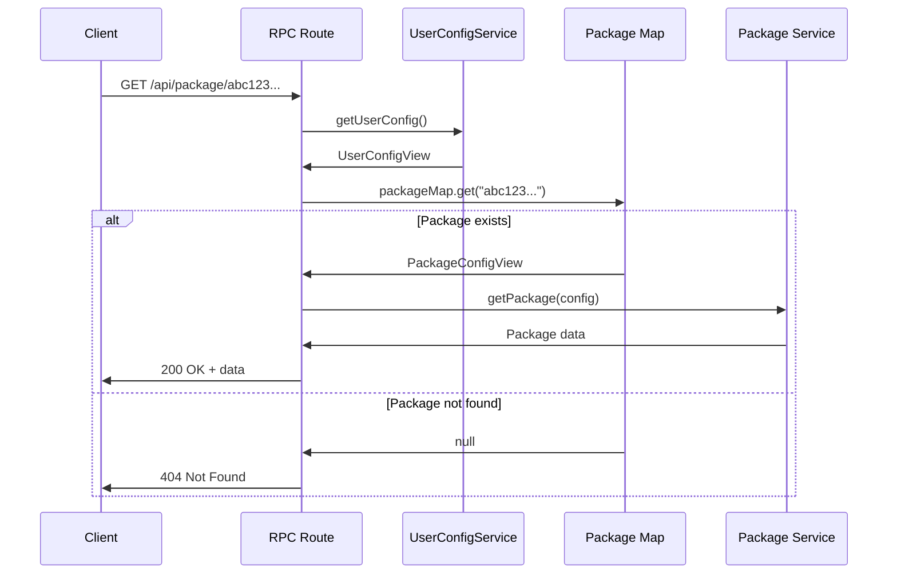

## Overview

Shipped uses a unique **hash-based package identification system** to secure the application against unauthorized access to external package registries. Unlike traditional REST APIs that accept arbitrary resource identifiers, Shipped requires all packages to be pre-configured, and each package is identified by a cryptographic hash of its configuration.

## The Security Problem

### Traditional Approach

Most package tracking services use human-readable identifiers:

```
GET /api/packages/github/vuejs/vue
GET /api/packages/npm/react
GET /api/packages/pypi/django
```

**Problems**:

1. **Arbitrary access** - Anyone can query any package
2. **API abuse** - Users can exhaust rate limits by probing random packages
3. **Privacy leaks** - Attackers can probe for private package names
4. **Unpredictable costs** - Cannot forecast external API usage

### Shipped's Approach

Shipped uses content-addressed hashes:

```
GET /api/packages/a1b2c3d4e5f6...
```

The hash is derived from:
- Package name
- Provider type
- Package-level configuration
- Provider-level configuration

**Benefits**:

1. **Pre-configuration required** - Only configured packages are accessible
2. **Rate limit predictability** - Known package set = predictable API usage
3. **No probing** - Cannot guess valid hashes
4. **Automatic cache invalidation** - Config changes produce new hashes

## Hash Generation

### What's in the Hash?

The package hash is computed from its complete configuration:

```typescript
// Package configuration
const packageConfig = {
  spec: {
    name: "vuejs/vue",           // Package identifier
    provider: "github",          // Provider type
    extra: {                     // Package-specific settings
      includePrereleases: true,
      maxReleases: 10
    }
  },
  providerExtra: {               // Provider-level defaults
    maxReleases: 50,
    includePrereleases: false
  }
};

// Hash all fields
const packageId = hash(packageConfig);
// Production: "a1b2c3d4e5f6789..."
// Development: "vuejs/vue:github:pkg_extra_hash:provider_extra_hash"
```

**Reference**: Described in `docs/architecture/package-system.md:110-143`

### Implementation

```typescript
// libs/config/views/package.ts
class PackageConfigView {
  get id(): string {
    return PackageConfigView.hash(this);
  }

  static hash(config: PackageConfigView): string {
    if (import.meta.dev) {
      // Human-readable in development for debugging
      return `${config.spec.name}:${config.spec.provider}:${hash(config.spec.extra)}:${hash(config.providerExtra)}`;
    }

    // Cryptographic hash in production
    return hash({
      spec: config.spec,
      extra: config.providerExtra,
    });
  }
}
```

**Reference**: Adapted from `docs/architecture/package-system.md:124-143`

### Development vs Production

| Environment | Format | Example | Purpose |
|-------------|--------|---------|----------|
| **Development** | `name:provider:extras_hash:provider_hash` | `vuejs/vue:github:a1b2:c3d4` | Human-readable debugging |
| **Production** | Cryptographic hash | `a1b2c3d4e5f6789...` | Security through obscurity |

Development mode makes it easy to identify packages in logs, while production mode ensures hashes cannot be reverse-engineered.

## Security Validation

### Request Flow

Every package request must pass hash validation:



### Hash Validation Logic

```typescript
// server/rpc/routes/package.ts (adapted)
const getPackage = o.procedure
  .input(z.object({ id: z.string() }))
  .handler(({ input }) =>
    Effect.gen(function* () {
      const config = yield* UserConfigService;

      // CRITICAL: Only allow pre-configured packages
      const pkg = config.getPackageById(input.id);
      if (pkg._tag === "None") {
        return yield* Effect.fail(
          new PackageNotFoundError({
            id: input.id,
          })
        );
      }

      // Hash is valid - proceed with fetching
      return yield* packageService.getOneById(input.id);
    })
  );
```

**Reference**: Adapted from `docs/architecture/package-system.md:406-427`

### The Package Map

All valid packages are stored in an O(1) lookup map:

```typescript
// libs/config/views/user.ts
class UserConfigView {
  get packageMap(): ReadonlyMap<string, PackageConfigView> {
    const map = new Map<string, PackageConfigView>();

    for (const list of this.lists) {
      for (const pkg of list.packages) {
        map.set(pkg.id, pkg);  // Key = hash, Value = config
      }
    }

    return map;
  }

  getPackageById(id: string): Option<PackageConfigView> {
    return Option.fromNullable(this.packageMap.get(id));
  }
}
```

**Reference**: Adapted from `docs/architecture/package-system.md:188-214`

This provides **constant-time validation** regardless of package count.

## Attack Prevention

### Scenario 1: Package Probing

**Attack**: Try to discover configured packages by guessing hashes

```bash
# Attacker tries random hashes
curl http://shipped.example.com/api/package/00000000
curl http://shipped.example.com/api/package/11111111
curl http://shipped.example.com/api/package/aaaaaaaa
```

**Defense**: Cryptographic hashes are not guessable

- **Hash space**: 2^256 possible hashes (SHA-256)
- **Success probability**: ~1 in 10^77 per guess
- **Infeasible**: Would take trillions of years to find one valid hash

### Scenario 2: Arbitrary Package Access

**Attack**: Try to fetch unconfigured packages

```bash
# Attacker wants to access a package not in config
# They know the package exists: github/torvalds/linux
# But they need the hash...

# Calculate hash for arbitrary package
import { hash } from 'ohash';
const maliciousHash = hash({ 
  name: 'torvalds/linux', 
  provider: 'github' 
});

curl http://shipped.example.com/api/package/${maliciousHash}
```

**Defense**: Hash includes provider configuration

- User cannot know the `providerExtra` values used in the hash
- Even if they guess the package spec, the provider config will be wrong
- Result: Hash mismatch → 404 Not Found

### Scenario 3: API Rate Limit Exhaustion

**Attack**: Make rapid requests to exhaust external API rate limits

```bash
# Attacker makes 10,000 requests per minute
for i in {1..10000}; do
  curl http://shipped.example.com/api/package/random_hash_$i
done
```

**Defense**: Multiple layers

1. **Hash validation** - Invalid hashes rejected before external API call
2. **Rate limiting** - ORPC middleware limits requests per IP
3. **Caching** - Valid requests are cached (no repeated API calls)
4. **Request coalescing** - Duplicate requests share single API call

**Result**: External API receives minimal traffic regardless of attack volume

### Scenario 4: Configuration Injection

**Attack**: Try to inject malicious config to create new hashes

**Defense**: Config is file-based, not user-editable

- Config files live on the server filesystem
- No API endpoints accept config changes
- Users cannot modify `lists.yaml` without server access
- If attacker has server access, game over anyway (different threat model)

## Configuration Security

### Package Whitelisting

All accessible packages must be declared in configuration:

```yaml
# config/lists.yaml
lists:
  - name: "My Packages"
    slug: "my-packages"
    packages:
      - name: "vuejs/vue"
        provider: "github"
      - name: "react"
        provider: "npm"
      # Any package not listed here is inaccessible
```

This creates a **whitelist** of allowed packages. The hash-based system enforces it.

### Provider Configuration Isolation

Provider settings affect the hash:

```yaml
# config/providers.yaml
providers:
  github:
    maxReleases: 50
    includePrereleases: false
    token: "ghp_secret_token"  # NOT included in hash
```

**Important**: Secrets like API tokens are **not** included in the hash. Only settings that affect the response shape are hashed.

### Cache Invalidation

Changing any hashed configuration produces a new hash:

```yaml
# Before
packages:
  - name: "vuejs/vue"
    provider: "github"
    extra:
      maxReleases: 10
# Hash: abc123...

# After
packages:
  - name: "vuejs/vue"
    provider: "github"
    extra:
      maxReleases: 20  # Changed!
# Hash: def456...  (different!)
```

**Security benefit**: Old cached data with `abc123` is not returned for new config `def456`. Each config variation has its own isolated cache entry.

**Reference**: Described in `docs/architecture/package-system.md:116-120`

## Threat Model

### In Scope

Threats the hash system protects against:

| Threat | Protection |
|--------|------------|
| **Unauthorized package access** | Hash validation blocks unconfigured packages |
| **API rate limit abuse** | Predictable package set limits external calls |
| **Package enumeration** | Hashes are not guessable or reversible |
| **Cache poisoning** | Config changes invalidate old hashes |
| **Privilege escalation** | No API to add packages without config file access |

### Out of Scope

Threats the hash system does NOT protect against:

| Threat | Reason |
|--------|--------|
| **Server compromise** | Attacker with server access can modify config files |
| **DDoS attacks** | Rate limiting handles this, not hashing |
| **External API compromise** | Shipped trusts provider APIs (GitHub, NPM, etc.) |
| **Stolen credentials** | Config file access = legitimate access |

### Assumptions

1. **Config files are secure** - Only authorized users can modify them
2. **Hash function is secure** - Using `ohash` with SHA-256
3. **Client cannot forge hashes** - Hashing is server-side only
4. **Provider APIs are trusted** - We trust GitHub, NPM, etc.

## Best Practices

### Minimize Package Exposure

Only configure packages you actually need:

```yaml
# Bad - exposing unnecessary packages
packages:
  - name: "every/package"
    provider: "github"
  - name: "on/github"
    provider: "github"
  # ... 50,000 packages ...

# Good - only packages you're tracking
packages:
  - name: "vuejs/vue"
    provider: "github"
  - name: "nuxt/nuxt"
    provider: "github"
```

Smaller package list = smaller attack surface.

### Protect Configuration Files

Use proper file permissions:

```bash
# Config directory should not be world-writable
chmod 755 config/
chmod 644 config/*.yaml

# Only owner can write
chown app:app config/
```

### Use Environment Variables for Secrets

Never put secrets in config files:

```yaml
# Bad
providers:
  github:
    token: "ghp_1234567890abcdef"  # Hardcoded!

# Good
providers:
  github:
    token: ${GITHUB_TOKEN}  # From environment
```

Better yet, configure secrets via environment variables:

```bash
export GITHUB_TOKEN=ghp_1234567890abcdef
```

### Monitor for Suspicious Activity

Log failed hash validations:

```typescript
if (pkg._tag === "None") {
  yield* Effect.logWarning("Invalid package hash requested", {
    hash: input.id,
    ip: request.ip,
  });
  return yield* Effect.fail(new PackageNotFoundError({ id: input.id }));
}
```

Spikes in 404s may indicate probing attacks.

### Rate Limiting

Combine hash security with rate limiting:

```typescript
// server/rpc/routes/package.ts
const getPackage = baseProcedure
  .use(
    createRatelimitMiddleware({
      key: (ctx) => ctx.request.ip,
      maxRequests: 100,
      window: 60000,  // 100 requests per minute
    })
  )
  .handler(async ({ input }) => {
    // Hash validation + rate limiting = defense in depth
  });
```

**Reference**: Similar to `server/rpc/routes/config.ts:75-81`

## Limitations

### Not True Access Control

The hash system is **not a substitute for authentication**:

- Anyone with a valid hash can access the package
- Hashes are included in URLs (visible in logs, browser history)
- If you need true access control, add authentication middleware

### Development Mode Exposure

Development hashes are human-readable:

```
vuejs/vue:github:abc123:def456
```

This reveals:
- Package name
- Provider type
- Partial configuration hashes

**Mitigation**: Never use development mode in production:

```bash
NODE_ENV=production  # Forces production hash format
```

### Client-Side Visibility

Hashes are visible to clients:

```javascript
// Browser can see all package hashes
const packages = [
  { id: "abc123...", name: "Vue.js" },
  { id: "def456...", name: "React" },
];
```

If a client knows a hash, they can access that package. This is by design (they need the hash to fetch package data).

## Summary

Shipped's hash-based security model provides:

- **Configuration-driven access control** - Only pre-configured packages are accessible
- **Automatic cache invalidation** - Config changes produce new hashes
- **Attack prevention** - Cannot guess, enumerate, or inject package requests
- **Rate limit predictability** - Known package set enables forecasting
- **Defense in depth** - Combines with caching, coalescing, and rate limiting

**Key insight**: Security through content addressing. By deriving identifiers from configuration rather than accepting arbitrary input, Shipped eliminates entire classes of attacks.

This architecture is ideal for self-hosted deployments where:
- Admin controls configuration via files
- Users consume pre-configured packages
- External API costs must be predictable
- Attack surface should be minimal